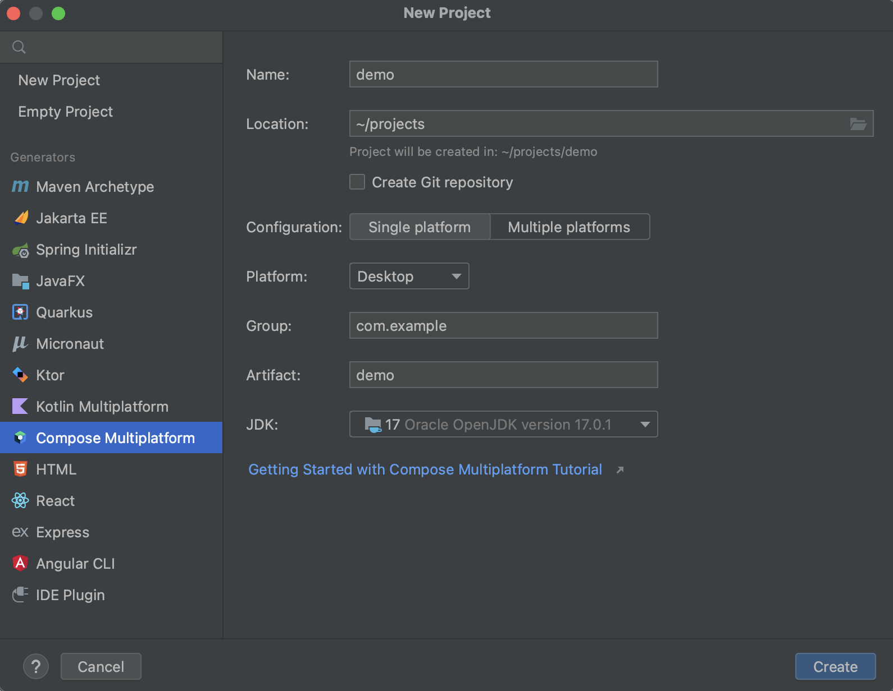
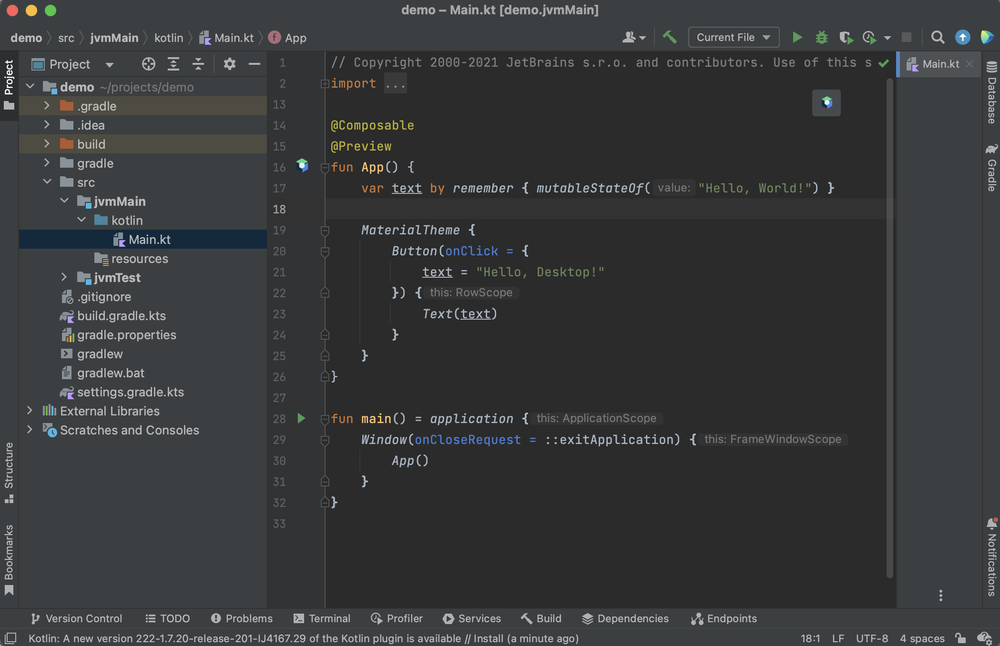

[](https://confluence.jetbrains.com/display/ALL/JetBrains+on+GitHub)
[](https://opensource.org/licenses/Apache-2.0)
# [Compose Multiplatform](https://github.com/JetBrains/compose-multiplatform) desktop application

> **Note**
> If you have any issues, please report them on [GitHub](https://github.com/JetBrains/compose-multiplatform/issues).

Compose for Desktop can produce applications for macOS, Linux, and Windows.
You can use any of these platforms with our template.

Follow our tutorial below to create a simple desktop application using the Compose Multiplatform UI framework.

If you want to create an application targeting mobile platforms – iOS and Android – use the [Compose Multiplatform mobile application](https://github.com/JetBrains/compose-multiplatform-ios-android-template#readme) template.

## Before you start

Install the following tools:

* JDK 11 or later
* IntelliJ IDEA Community Edition or IntelliJ IDEA Ultimate 2020.3 or later (other editors may also work, but we'll use IntelliJ IDEA in this tutorial)
* The [Compose Multiplatform IDE support plugin](https://plugins.jetbrains.com/plugin/16541-compose-multiplatform-ide-support)

Compose development can be simplified by adding support for the `@Preview` annotation on argument-less `@Composable` functions.
The plugin shows how a particular composable function looks in the IDE.

## Creating a new project with an IDE

Starting with 2020.3, IntelliJ IDEA comes with a new project wizard that can automatically create a Compose for Desktop
project.

> **Note**
> When creating a project, select JDK 11 or later. To use the native distribution packaging, select JDK 15 or later.





### Update the plugin

Before you start, ensure that you’re using the latest version of the Compose Multiplatform IDE support plugin:

1. Check the latest release version in the [Compose Multiplatform GitHub repository](https://github.com/JetBrains/compose-multiplatform/releases) or on the [Kotlin](https://kotlinlang.org/) website.
2. Open the `build.gradle.kts` file for your project and update the version:

    ```kotlin
    plugins {
       kotlin("jvm") version "1.9.0"
       id("org.jetbrains.compose") version "1.5.0"
    }
    ```

## Creating a new Compose project without an IDE

It is also possible to create a Compose project manually in the terminal.

We recommend building Compose for Desktop projects with Gradle.
JetBrains provides a simple way of building such projects using a special Gradle plugin.

> **Note**
> You can clone the existing template for a [desktop](https://github.com/JetBrains/compose-multiplatform-desktop-template/) or
[multiplatform](https://github.com/JetBrains/compose-multiplatform-template/) application, or create one from scratch.

1. Create a new directory named `sample`:

    ```shell
    mkdir sample
    cd sample
    ```

2. Create the `settings.gradle.kts` file and modify it as follows:

    ``` kotlin
    pluginManagement {
       repositories {
           gradlePluginPortal()
           maven("https://maven.pkg.jetbrains.space/public/p/compose/dev")
       }
    }
    ```
   
3. Create the `build.gradle.kts` file with the following content:

    ``` kotlin
    plugins {
       kotlin("jvm") version "1.9.0"
       id("org.jetbrains.compose") version "1.5.0"
    }
    
    
    repositories {
       mavenCentral()
       maven("https://maven.pkg.jetbrains.space/public/p/compose/dev")
       google()
    }
    
    
    dependencies {
       implementation(compose.desktop.currentOs)
    }
    
    
    compose.desktop {
       application {
           mainClass = "MainKt"
       }
    }
    ```

4. Create `src/main/kotlin/main.kt` and add the following code to it:

    ```kotlin
    import androidx.compose.foundation.layout.Arrangement
    import androidx.compose.foundation.layout.Column
    import androidx.compose.foundation.layout.fillMaxSize
    import androidx.compose.material.Button
    import androidx.compose.material.MaterialTheme
    import androidx.compose.material.Text
    import androidx.compose.runtime.mutableStateOf
    import androidx.compose.runtime.remember
    import androidx.compose.ui.Alignment
    import androidx.compose.ui.Modifier
    import androidx.compose.ui.unit.dp
    import androidx.compose.ui.window.Window
    import androidx.compose.ui.window.application
    import androidx.compose.ui.window.rememberWindowState
    
    
    fun main() = application {
       Window(
           onCloseRequest = ::exitApplication,
           title = "Compose for Desktop",
           state = rememberWindowState(width = 300.dp, height = 300.dp)
       ) {
           val count = remember { mutableStateOf(0) }
           MaterialTheme {
               Column(Modifier.fillMaxSize(), Arrangement.spacedBy(5.dp)) {
                   Button(modifier = Modifier.align(Alignment.CenterHorizontally),
                       onClick = {
                           count.value++
                       }) {
                       Text(if (count.value == 0) "Hello World" else "Clicked ${count.value}!")
                   }
                   Button(modifier = Modifier.align(Alignment.CenterHorizontally),
                       onClick = {
                           count.value = 0
                       }) {
                       Text("Reset")
                   }
               }
           }
       }
    }
    ```

## Run the application

### In the editor

You can run and debug the application by clicking **Run** in the gutter near the `main()` function declaration:


### Using Gradle tasks

1. In IntelliJ IDEA, open `build.gradle.kts`. After the necessary dependencies from the Maven repositories are downloaded, your project will be ready.
2. In the [Gradle tool window](https://www.jetbrains.com/help/idea/jetgradle-tool-window.html), select `sample/Tasks/compose desktop/run`:


The first run may take some time.

3. Click the button several times to see that the application reacts and updates the UI:


You can also run Gradle tasks in the terminal:

* `./gradlew run` to run the application
* `./gradlew package` to store native distribution into `build/compose/binaries`

## Next steps

We encourage you to explore Compose Multiplatform further and try out more projects:

* [Learn about other cases for using the Compose Multiplatform UI framework](https://github.com/JetBrains/compose-multiplatform#readme)
* [Create an application targeting iOS and Android with Compose Multiplatform](https://github.com/JetBrains/compose-multiplatform-ios-android-template#readme)
* [Complete more Compose Multiplatform tutorials](https://github.com/JetBrains/compose-multiplatform/blob/master/tutorials/README.md)
* [Explore more advanced Compose Multiplatform example projects](https://github.com/JetBrains/compose-multiplatform/blob/master/examples/README.md)